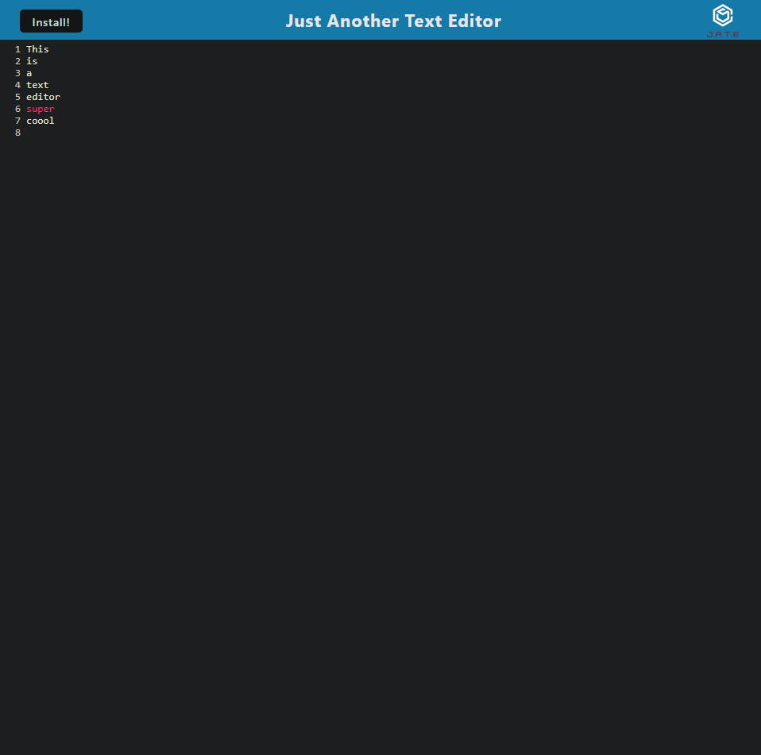

# Progressive Web Applications: Text Editor

This is a text editor that runs in the browser. Its feature a number of data persistence techniques that serve as redundancy in case one of the options is not supported by the browser. The application will also function offline.

## Table Of Contents

<li><a href="#usage">User Story</a></li>
<li><a href="#technology">Technology</a></li>
<li><a href="#link">Link</a></li>
<li><a href="#screenshots">Screenshots</a></li>
<li><a href="#feedback">Feedback</a></li>
<li><a href="#license">License</a></li>

## User Story

```md
AS A developer
I WANT to create notes or code snippets with or without an internet connection
SO THAT I can reliably retrieve them for later use
```

## Acceptance Criteria

```md
GIVEN a text editor web application
WHEN I open my application in my editor
THEN I should see a client server folder structure
WHEN I run `npm run start` from the root directory
THEN I find that my application should start up the backend and serve the client
WHEN I run the text editor application from my terminal
THEN I find that my JavaScript files have been bundled using webpack
WHEN I run my webpack plugins
THEN I find that I have a generated HTML file, service worker, and a manifest file
WHEN I use next-gen JavaScript in my application
THEN I find that the text editor still functions in the browser without errors
WHEN I open the text editor
THEN I find that IndexedDB has immediately created a database storage
WHEN I enter content and subsequently click off of the DOM window
THEN I find that the content in the text editor has been saved with IndexedDB
WHEN I reopen the text editor after closing it
THEN I find that the content in the text editor has been retrieved from our IndexedDB
WHEN I click on the Install button
THEN I download my web application as an icon on my desktop
WHEN I load my web application
THEN I should have a registered service worker using workbox
WHEN I register a service worker
THEN I should have my static assets pre cached upon loading along with subsequent pages and static assets
WHEN I deploy to Heroku
THEN I should have proper build scripts for a webpack application
```

## Technology

#### <strong>Below is a list of the technologies used.</strong>

<li>NodeJs</li>
<li>Express.js</li>
<li>HTML 5</li>
<li>CSS 3</li>
<li>JavaScript</li>

## Usage

<figure>
<figcaption>This is a Nodejs application so you will need to download this and all of the dependencies to run this locally on your machine.
Run: npm i 
After all dependencies have been installed
Run: npm run start:dev

This will start the application on your machine
From there you can go to localhost:3000 to view the application.
Otherwise please visit the website.
You can click the install button to bring it outside of the browser as well as create text.

</figcaption>
</figure>


## Link

https://infinite-hamlet-69452.herokuapp.com/
https://github.com/JonSpircoff7/Text_editor

## Screenshots



## Feedback

    If you have any feedback on what we can add to our application or any issues that you have run into, please feel free to reach out to use at our github or by email at blank@yahoo.com.

## License

[MIT](https://choosealicense.com/licenses/mit/)
